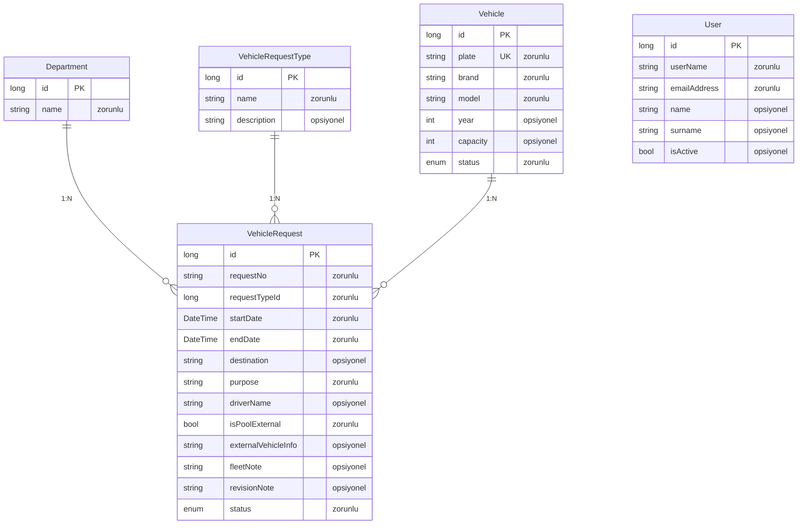
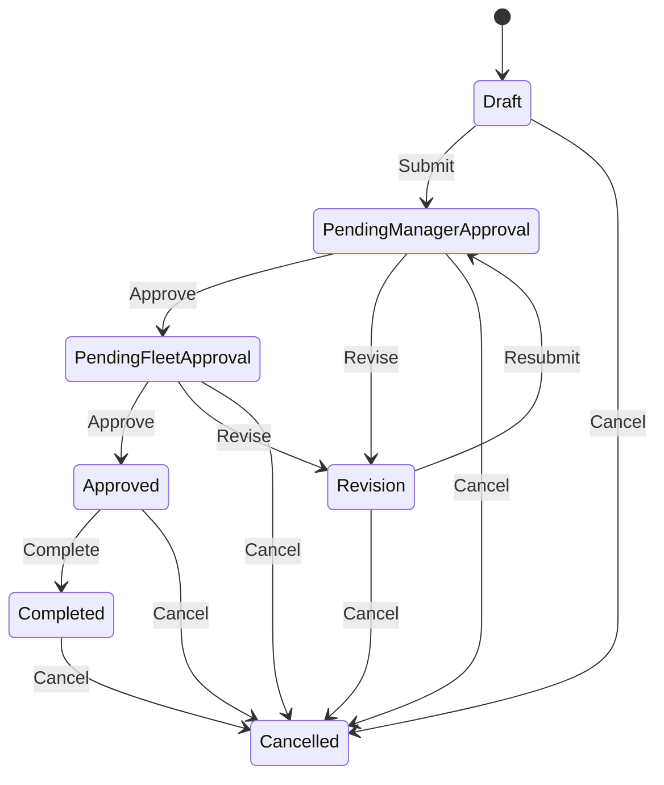
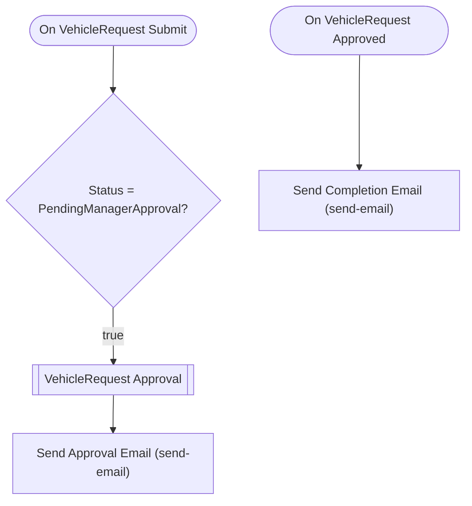

# aractalep — Talep Analizi

> Bu belge Archipid talep olgunlaştırma (discovery) akışıyla üretildi.

## Orijinal Talep

araç talep uygulamasına ihtiyacımız var, şirket içerisinde kişiler araç talebinde bulunacak

## Özet

Şirket çalışanlarının araç taleplerini dijital ortamda oluşturduğu, yönetici ve filo sorumlusunun onayladığı, filo sorumlusunun araç atadığı bir süreç yönetimi uygulaması. Hem şirkete ait araçlar hem de havuz dışı araç talepleri tek platformda yönetilir.

Çalışan talebi oluşturur → Yönetici onaylar (ya da revize ister) → Filo Sorumlusu onaylar ve araç atar → Talep tamamlanır. Reddedilirse talep oluşturana geri döner. Kullanım sonunda araç iade edilir ve talep kapatılır.

## Kapsam

- Araç talep formu oluşturma (talep türü, tarih aralığı, amaç, sürücü bilgisi)
- 2 adımlı onay süreci: 1. Yönetici, 2. Filo Sorumlusu
- Araç havuzu yönetimi (plaka, marka, model, kapasite, durum)
- Filo sorumlusu tarafından araç atama (havuz içi veya havuz dışı)
- Talep türü bazlı sınıflandırma ve raporlama
- Araç kullanım geçmişi takibi

## Kapsam Dışı

- Dosya/belge eki (ehliyet fotokopisi, görev emri PDF'i vb.) — bu sürümde desteklenmiyor
- SMS veya push bildirim — yalnızca e-posta bildirimi üretilir
- SLA / gecikme takibi / otomatik eskalasyon — bu sürümde desteklenmiyor
- Araç GPS/konum takibi — bu sürümde desteklenmiyor
- Tarih çakışması otomatik engeli — üretilemiyor, filo sorumlusu manuel kontrol eder

## Açık Noktalar

- Havuz dışı araç taleplerinde araç plakası/bilgisi sonradan mı girilecek, yoksa talep formunda mı belirtilecek?
- Araç iade edildiğinde aracın durumu otomatik 'Müsait' e mi dönecek, yoksa filo sorumlusu manuel mi güncelleyecek?

## Eksiklikler

- Sürücü, talep sahibinden farklı olabilir — talep formunda ayrı 'sürücü' alanı tutulması gerekebilir
- Birden fazla kişinin aynı araca aynı tarihte talep açması durumunda çakışma kontrolü yok — filo sorumlusu manuel dikkat etmeli
- Araç bakım/arıza durumu için ayrı bir 'bakımda' statüsü gerekebilir

## Öneriler

- Araç entity'sine 'Müsait, Kullanımda, Bakımda, Hizmet Dışı' gibi durum takibi eklenebilir
- Talep onaylandıktan sonra araç atama ve iade tarihleri kesinleştiğinde takvim görünümü faydalı olur
- Filo raporları için araç bazında aylık kullanım özeti widget'ı eklenebilir

## Veri Modeli

### Department — Birim

| Alan | Tip | Zorunlu | Uzunluk |
|---|---|---|---|
| `id` | long | Evet | — |
| `name` | string | Evet | 200 |

**Neye bağlı:** VehicleRequest (1:N, bu tablo "bir" tarafı)

### VehicleRequestType — Talep Türü

| Alan | Tip | Zorunlu | Uzunluk |
|---|---|---|---|
| `id` | long | Evet | — |
| `name` | string | Evet | 200 |
| `description` | string | Hayır | 500 |

**Neye bağlı:** VehicleRequest (1:N, bu tablo "bir" tarafı)

### Vehicle — Araç

| Alan | Tip | Zorunlu | Uzunluk |
|---|---|---|---|
| `id` | long | Evet | — |
| `plate` | string | Evet | 20 |
| `brand` | string | Evet | 100 |
| `model` | string | Evet | 100 |
| `year` | int | Hayır | — |
| `capacity` | int | Hayır | — |
| `status` | enum (Available,InUse,UnderMaintenance,OutOfService) | Evet | — |

**Neye bağlı:** VehicleRequest (1:N, bu tablo "bir" tarafı)

### VehicleRequest — Araç Talebi

| Alan | Tip | Zorunlu | Uzunluk |
|---|---|---|---|
| `id` | long | Evet | — |
| `requestNo` | string | Evet | 50 |
| `requestTypeId` | long | Evet | — |
| `startDate` | DateTime | Evet | — |
| `endDate` | DateTime | Evet | — |
| `destination` | string | Hayır | 500 |
| `purpose` | string | Evet | 1000 |
| `driverName` | string | Hayır | 200 |
| `isPoolExternal` | bool | Evet | — |
| `externalVehicleInfo` | string | Hayır | 500 |
| `fleetNote` | string | Hayır | 1000 |
| `revisionNote` | string | Hayır | 1000 |
| `status` | enum (Draft,PendingManagerApproval,PendingFleetApproval,Approved,Revision,Completed,Cancelled) | Evet | — |

**Neye bağlı:** Department (1:N, bu tablo "çok" tarafı) · VehicleRequestType (1:N, bu tablo "çok" tarafı) · Vehicle (1:N, bu tablo "çok" tarafı)

### User — Kullanıcı (Sistem)

| Alan | Tip | Zorunlu | Uzunluk |
|---|---|---|---|
| `id` | long | Evet | — |
| `userName` | string | Evet | 64 |
| `emailAddress` | string | Evet | 256 |
| `name` | string | Hayır | 128 |
| `surname` | string | Hayır | 128 |
| `isActive` | bool | Hayır | — |

**Neye bağlı:** bağımsız tablo

## İş Akışları

### Araç Talebi — durum makinesi

**Onay adımları**

| # | Adım | Atanan | Aksiyonlar | Zorunlu alanlar |
|---|---|---|---|---|
| 1 | Yönetici Onayı | Rol: `Manager` | Onayla (approve), Revize Et (revise) | `revisionNote` |
| 2 | Filo Sorumlusu Onayı | Rol: `FleetManager` | Onayla ve Araç Ata (approve), Revize Et (revise) | `revisionNote` |

Reddedilirse kayıt **`Revision`** durumuna döner.

### Akış: VehicleRequest Approval Flow

Auto-generated approval flow for VehicleRequest. Customize email templates and add conditions as needed.

## Örnek Senaryolar

### Mutlu Yol — Talep Oluşturma ve Onaylama

**Aktör:** Çalışan

1. Çalışan araç talebini oluşturur (tür, tarih, amaç, sürücü bilgisi girer).
2. Talep 'Taslak' durumunda kaydedilir.
3. Çalışan talebi onaya gönderir; durum 'Yönetici Onayında' olur.
4. Yönetici talebi inceler ve onaylar; durum 'Filo Onayında' olur.
5. Filo Sorumlusu talebi onaylar, araç atar; durum 'Onaylandı/Araç Atandı' olur.
6. Talep kullanım sonunda 'Tamamlandı' olarak kapatılır.

**Dokunulan kayıtlar:** VehicleRequest, Vehicle, VehicleRequestType  
**Durum geçişleri:** Draft->PendingManagerApproval · PendingManagerApproval->PendingFleetApproval · PendingFleetApproval->Approved · Approved->Completed

### Revizyon Yolu — Yönetici Revize İstedi

**Aktör:** Yönetici

1. Yönetici talebi inceler, eksik veya hatalı bilgi görür.
2. Revize ister ve revizyon notu girer; durum 'Revizyon' olur.
3. Talep çalışana geri döner.
4. Çalışan bilgileri düzeltir ve talebi tekrar onaya gönderir.
5. Süreç yönetici onayından itibaren yeniden başlar.

**Dokunulan kayıtlar:** VehicleRequest  
**Durum geçişleri:** PendingManagerApproval->Revision · Revision->PendingManagerApproval

### Yetki Reddi — Yetkisiz Erişim

**Aktör:** Çalışan

1. Çalışan başka bir çalışanın talebini onaylamaya çalışır — sistem izin vermez.
2. Çalışan araç havuzuna araç eklemeye çalışır — Filo Sorumlusu yetkisi gerekir, erişim reddedilir.
3. Çalışan yalnızca kendi taleplerini görüntüleyebilir ve düzenleyebilir.

**Dokunulan kayıtlar:** VehicleRequest, Vehicle  

## Elle Geliştirme Gerektirenler

Aşağıdaki maddeler senaryonun gereği ama üretilen koda yansımıyor — kod yazılması gerekir.

| Alan | İş | Neden | Geçici çözüm |
|---|---|---|---|
| validation | Araç-tarih çakışması kontrolü | Aynı araca aynı tarihte birden fazla onaylı talep atanamaz kuralı üretilemiyor — alan bazlı iş kuralı desteği yok. | Filo sorumlusu araç atamadan önce o aracın aktif taleplerini listeden kontrol eder. |
| flow | İade sonrası araç durumunun otomatik güncellenmesi | Talep tamamlandığında bağlı aracın durumunu otomatik 'Müsait' yapan çapraz kayıt otomasyonu üretilemiyor. | Filo sorumlusu iade işleminin ardından araç kaydının durumunu manuel günceller. |

## Şema Açıklamaları

- **Vehicle** — Şirkete ait araçların kaydıdır. Plaka, marka, model ve kapasite bilgileri tutulur. Havuz dışı araçlar için bu tablodan bağımsız açıklama alanı talep formunda yer alır.
- **Department** — Çalışanların bağlı olduğu birimleri tanımlar. Yönetici ataması bu yapı üzerinden yürür.
- **VehicleRequest** — Çalışanın araç talebini temsil eder. Talep türü, tarih aralığı, amaç ve sürücü bilgisi burada tutulur. İki adımlı onay sürecini bu kayıt yönetir.
- **VehicleRequestType** — Günlük kullanım, şehir dışı görev, servis aracı gibi talep türlerini tanımlar. Raporlama ve sınıflandırma için kullanılır.

- **VehicleRequest → Vehicle** — Onaylanan talebe filo sorumlusu bir araç atar; havuz dışıysa bu alan boş kalabilir.
- **VehicleRequest → VehicleRequestType** — Her talebin bir amacı/türü vardır; bu bilgi raporlamada kullanılır.
- **Department → VehicleRequest** — Talep hangi birimden geldiğini gösterir; yönetici onayı birim bazlıdır.
